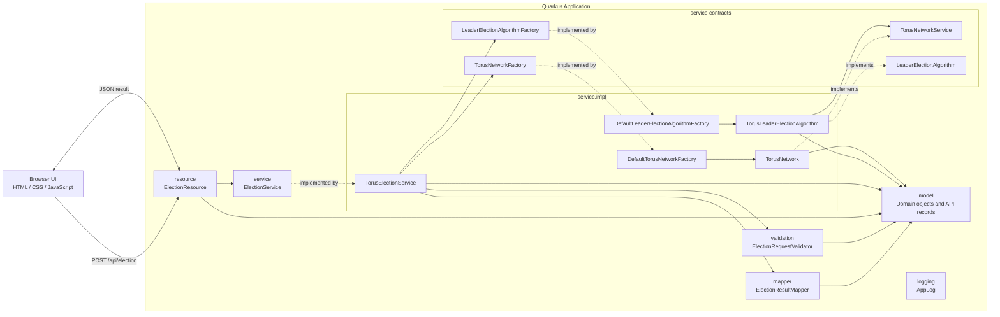

# Torus Network Leader Election Visualizer

A Quarkus web application for visualizing leader election in a two-dimensional torus network. The app uses a small Java REST API for the election engine and plain HTML, CSS, and browser JavaScript for the interface and canvas visualization.

## Educational Purpose

This project was developed for **SE616 - Software Engineering for Distributed Systems**. It is intended as an educational visualization of leader election behavior in a two-dimensional torus network.

## Requirements

- JDK 17 or later
- Maven 3.8 or later
- Internet access on the first Maven build so Maven can download Quarkus, Lombok, JUnit, and JaCoCo

## Run In Development

```bash
mvn quarkus:dev
```

Open the app at:

```text
http://localhost:8080
```

## Build

```bash
mvn package
```

Run the packaged Quarkus application:

```bash
java -jar target/quarkus-app/quarkus-run.jar
```

## Usage

1. Choose the number of rows and columns. Both values must be at least `2`.
2. Enter one unique process ID for every grid cell.
3. Click `Run Election` to execute the algorithm and display the final leader.
4. Click `Auto Animate` to replay the election reads with source-neighbor and receiver highlighting.
5. Click `Reset` to clear the visualization and status output.

Example input for a `4 x 4` torus:

```text
12 5 33 8
17 40 2 29
11 6 55 21
9 14 31 25
```

## Architecture

The project is organized as a Quarkus web app with a resource layer, service contracts, service implementations, and shared model objects:

```text
src/
  main/
    java/
      resource/
        ElectionResource.java
      validation/
        ElectionRequestValidator.java
        impl/
          DefaultElectionRequestValidator.java
      mapper/
        ElectionResultMapper.java
        impl/
          DefaultElectionResultMapper.java
      service/
        ElectionService.java
        LeaderElectionAlgorithm.java
        LeaderElectionAlgorithmFactory.java
        TorusNetworkFactory.java
        TorusNetworkService.java
        impl/
          DefaultLeaderElectionAlgorithmFactory.java
          DefaultTorusNetworkFactory.java
          TorusElectionService.java
          TorusLeaderElectionAlgorithm.java
          TorusNetwork.java
      logging/
        AppLog.java
      model/
        AnimationStep.java
        ElectionRequest.java
        ElectionResult.java
        NodeState.java
        Position.java
        PositionState.java
        ProcessNode.java
        StepState.java
    resources/
      META-INF/resources/
        index.html
        styles.css
        app.js
```

- `resource` exposes HTTP endpoints and delegates work to service contracts.
- `validation` contains request validation contracts and implementations.
- `mapper` contains response mapping contracts and implementations.
- `service` defines orchestration, network creation, and election execution contracts.
- `service.impl` contains concrete Quarkus beans and torus-specific service implementations.
- `model` contains domain objects and transport records shared by the resource and service layers.
- `META-INF/resources` contains the plain HTML, CSS, and browser JavaScript served by Quarkus.
- Lombok generates simple constructors, getters, setters, and equality methods.

### Component Diagram



## Algorithm Summary

Each process starts with its own ID as `maxKnownId`. During each round, every process reads the `maxKnownId` values known by its unique torus neighbors, resolved in right, left, down, up order with wrap-around duplicates removed on small grids. If a received value is larger than the process's current `maxKnownId`, the process updates its value.

Rounds continue until a complete pass finishes with no changes. The status panel shows this as `Rounds Checked`, so the final no-change convergence-check pass is included in the count. At that point the maximum process ID has propagated through the network, and the process with that ID is marked as leader.

The API returns:

- total rounds checked
- total messages exchanged
- final process states
- leader ID and position
- textual execution log
- animation steps containing source neighbor, receiving process, transmitted value, round number, and whether the receiver updated

## Tests

Run the unit tests and generate the JaCoCo coverage report:

```bash
mvn test
```

The generated coverage report is written to:

```text
target/site/jacoco/index.html
```

## Documentation

See the `docs` directory for the existing algorithm analysis, packaging notes, method specifications, and project documentation.

## License

This project is open source under the [MIT License](LICENSE).
